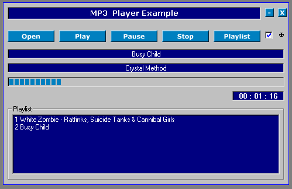



## MP3 Player Example

### Description

just a simple MP3 player with a few functions to get the "new guys" started with their new found love (and hate) for programming in Visual Basic.
 
### More Info
 
Like everything all good things have their down side. You will be required to have specific controls on your system. Don't worry.... nothing that will be impossible to find. I am working on a new part of my site right now which will contain these files and many more. If you need them just email me and I'll get them to you.

             |
---                |---
**Submitted On**   |2001-08-28 04:13:44
**By**             |[Jester23](https://github.com/Planet-Source-Code/PSCIndex/blob/master/ByAuthor/jester23.md)
**Level**          |Intermediate
**User Rating**    |4.0 (8 globes from 2 users)
**Compatibility**  |VB 5\.0
**Category**       |[Complete Applications](https://github.com/Planet-Source-Code/PSCIndex/blob/master/ByCategory/complete-applications__1-27.md)
**World**          |[Visual Basic](https://github.com/Planet-Source-Code/PSCIndex/blob/master/ByWorld/visual-basic.md)
**Archive File**   |[MP3 Player254648282001\.zip](https://github.com/Planet-Source-Code/jester23-mp3-player-example__1-26717/archive/master.zip)

